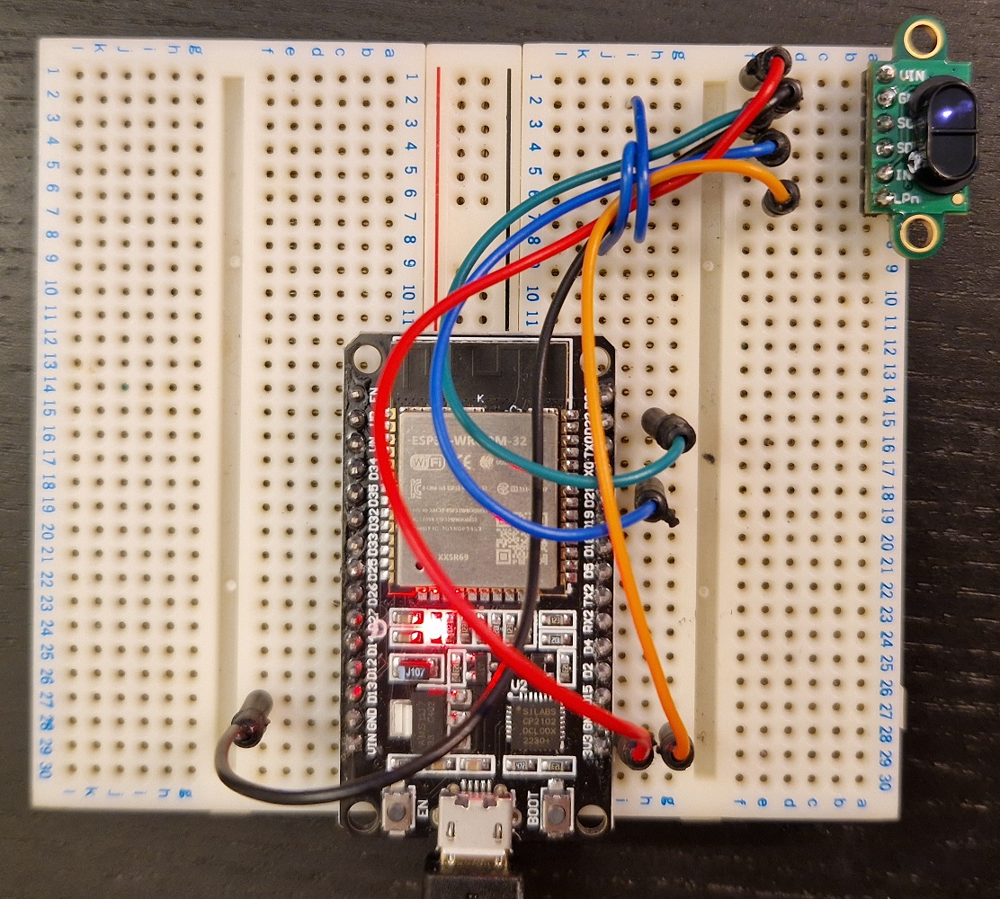
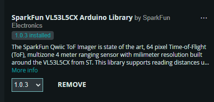

# VL53L5CX Distance Sensor with ESP32 Setup Guide

This guide provides step-by-step instructions on how to set up and use the VL53L5CX distance sensor with your ESP32 microcontroller for real-time 8x8 distance data visualization. The code is organized in a structured manner for easy navigation.


## Hardware Requirements
- ESP32 Board
- VL53L5CX Distance Sensor (connected via I2C)
- USB Cable (for programming and power supply)
- Wires (for connecting the sensor to the ESP32)

## Software Requirements
- Arduino IDE (for programming the ESP32)
- Python 3.x (for real-time visualization)

## Hardware Setup
Wire the VL53L5CX Sensor to the ESP32:
- SCL (Clock): Connect to ESP32 GPIO 22
- SDA (Data): Connect to ESP32 GPIO 21
- VCC: Connect to a 3.3V or 5V pin on the ESP32 (depending on the sensor's specifications)
- GND: Connect to a GND pin on the ESP32


## Software Setup
1. Setting Up the ESP32 with Arduino IDE
Install the Arduino IDE: Download and install it from arduino.cc.
2. Add ESP32 Board to Arduino IDE:
- Open the Arduino IDE.
- Go to File -> Preferences.
- In the "Additional Board Manager URLs" field, add:
```bash
https://raw.githubusercontent.com/espressif/arduino-esp32/gh-pages/package_esp32_index.json
```
- Go to Tools -> Board -> Boards Manager and search for "ESP32". Install the package.
3. Install Required Libraries:
SparkFun VL53L5CX Library: Install it via Tools -> Manage Libraries. Search for "SparkFun VL53L5CX" and install it.
SparkFun VL53L5CX


## Wiring